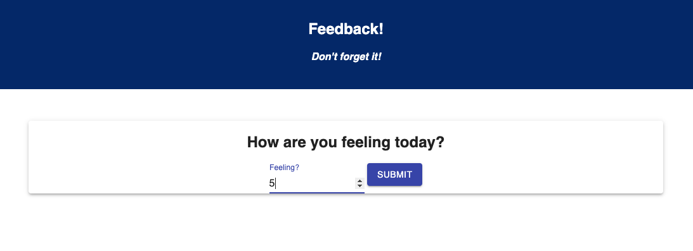
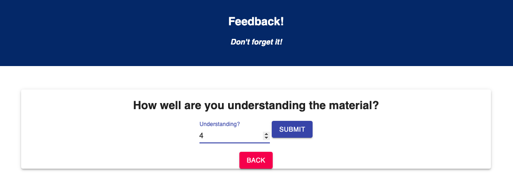
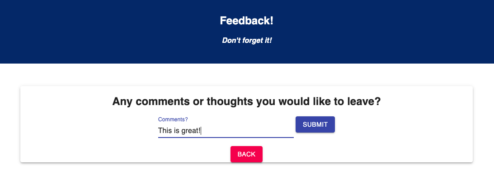
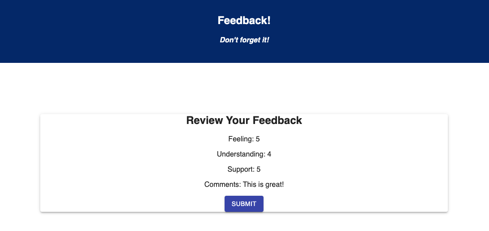

# React-Feedback-Loop

This is an app to give some feedback.

## Description

The goal for this project was to create an app to give different types of feedback on a new page after each submit.

My problem to solve this project happened to be the most concise way to store the data from each page in redux until needing send it to the database.
I ended up making an array of objects but that led to the problem of having 4 objects with different keys and while I found a solution to rendering them it caused other issues that couldn't be rectified.  I ended up making a reducer for each page, which fixed those issues but later realized I could have made an object on index.js to target with a single reducer.

### To Run App
On start up

```
npm install express
npm install redux react-redux react-router-dom
npm install @material-ui/core
npm run server
npm run client
```
After client is running it should take you to localhost:3000/#/ and you can begin the Feedback process.

### Screen Shots






### Built On
```
react.js
redux
node.js
express library
postgreSQL
Material-UI
```